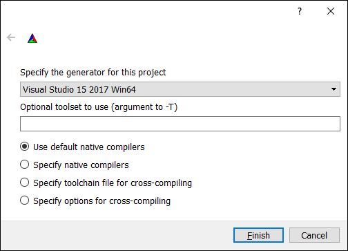
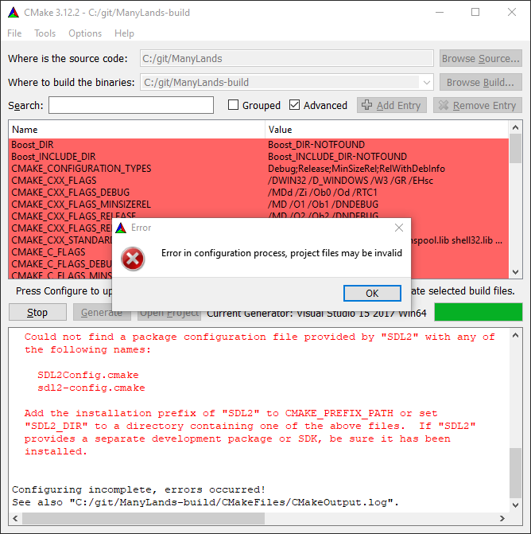
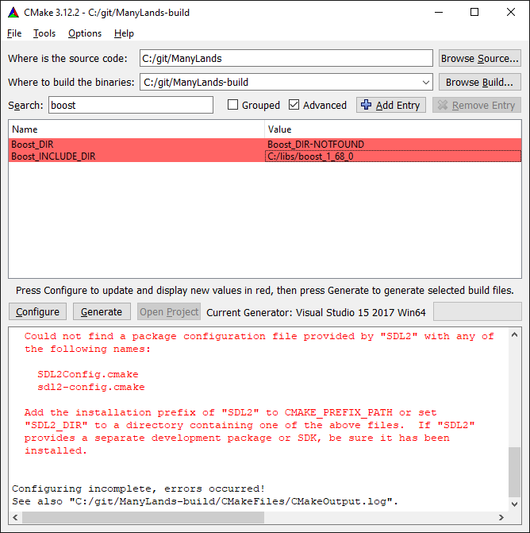
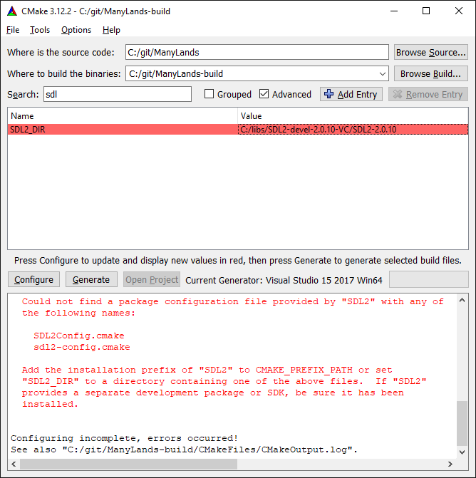
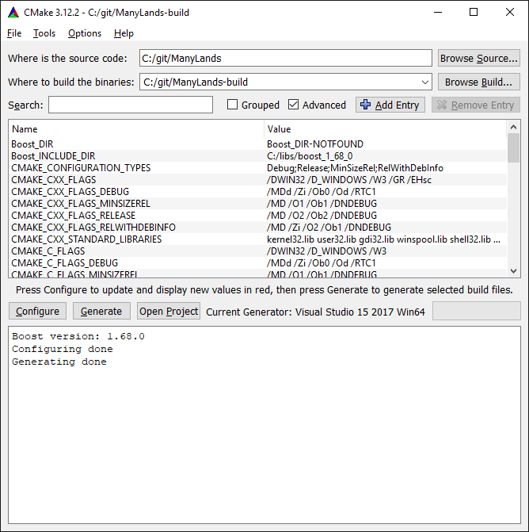

# Building

[ManyLands](README.md) can be compiled as a standalone application, as well as to [WebAssembly](https://webassembly.org/). ManyLands can be compiled on a wide variaty operational systems such as Windows, iOS, Linux, however, currently two build chains are officialy supported and confirmed to be working: 1) compiling on Windows using Visual Studio, 2) compiling on Ubuntu to WebAssembly using Emscripten.

If you have any issues with building ManyLands, please, do not hesitate to contact me directly by [email](#contact).

## Compiling on Windows using Visual Studio

1. Clone the ManyLands repository into a local folder of your choice, e.g., ```c:/git```

    ```
    cd c:/git
    git clone https://github.com/aleksandr-amirkhanov/manylands
    ```

2. Create a build folder, e.g., ```c:/git/ManyLands-build```
3. Open CMake and specify the source code folder as ```C:/git/ManyLands``` and the build folder as ```C:/git/ManyLands-build```

    

4. Press the ```Configure``` button
5. Set ```Visual Studio 15 2017 Win64``` as the generator. Another version of ```Visual Studio``` can be chosen, but it was not tested

    

6. Press the ```Finish``` button. CMake should give errors that ```SDL``` and ```Boost``` libraries could not be found.

    

7. Set the ```Boost_INCLUDE_DIR``` to the path to your Boost library, e.g., ```C:/libs/boost_1_68_0```

    

8. Set the ```SDL2_DIR``` to the path to your ```SDL``` library, e.g., ```C:/libs/SDL2-devel-2.0.10-VC/SDL2-2.0.10```. Please note, that SDL does not come with a .cmake file and you will have to create it manually as described [here](https://trenki2.github.io/blog/2017/06/02/using-sdl2-with-cmake/)

    

9. Press the ```Generate``` button

    

10. Open the Visual Studio project and press the compile button! The compilation should go without any issues

## Compiling on Ubuntu to WebAssembly using Emscripten

1. Install and configure [Emscripten](https://github.com/emscripten-core/emscripten)
2. Clone the ManyLands repository and configure it using CMake. Note, that you will have to specify paths to the SDL and Boost libraries

    ```
    git clone https://github.com/aleksandr-amirkhanov/manylands
    cd /mnt/c/git/ManyLands-web
    ./emconfigure cmake ../ManyLands -DCMAKE_BUILD_TYPE=Release
    ```

3. Build ManyLands with the following command

    ```
    ./emmake make
    ```

4. Done! Now you should be able to run ManyLands by opening ```ManyLands.html```