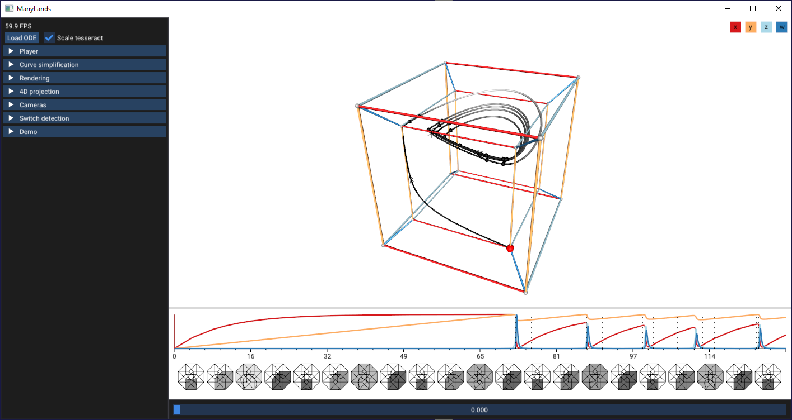

# ManyLands: A Journey Across 4D Phase Space of Trajectories

### Table of Contents
- [Overview](#Overview)
- [Building](#building)
- [Example](#example)
- [Citing](#citing)
- [License](#license)
- [Contact](#contact)
- [Acknowledgements](#acknowledgements)

## Overview

ManyLands is a tool for the exploration and analysis of precomputed 4D trajectories from continuous-time dynamical systems of biological interest.
The concepts in ManyLands have been inspired by the book [Flatland: a Romance of Many Dimensions](https://en.wikipedia.org/wiki/Flatland).
The mathematical domain scientist—as another Square—visits and navigates across all Lands, i.e., subspaces, and their respective dimensions.We introduce three different Lands: 4D HyperLand, 3D SpaceLand, and 2D FlatLand.
ManyLands includes an additional linked diagram, called TimeLines.

The full paper, as well as the full version of ManyLands, are available on our [official repository](https://amirkhanov.net/manylands/).

## Building

Please, check out our documentation page on [building ManyLands](BUILDING.md).

## Example

## Citing

If you are using this work in your research, please cite the following paper:

    @article{doi:10.1111/cgf.13828,
    author = {Amirkhanov, Aleksandr and Kosiuk, Ilona and Szmolyan, Peter and Amirkhanov, Artem and Mistelbauer, Gabriel and Gröller, M. Eduard and Raidou, Renata G.},
    title = {ManyLands: A Journey Across 4D Phase Space of Trajectories},
    journal = {Computer Graphics Forum},

    volume = {38},
    number = {7},
    pages = {191-202},
    keywords = {CCS Concepts, • Human-centered computing → Scientific visualization, Visual analytics, Web-based interaction},
    doi = {10.1111/cgf.13828},
    url = {https://onlinelibrary.wiley.com/doi/abs/10.1111/cgf.13828},
    eprint = {https://onlinelibrary.wiley.com/doi/pdf/10.1111/cgf.13828},
    abstract = {Abstract Mathematical models of ordinary differential equations are used to describe and understand biological phenomena. These models are dynamical systems that often describe the time evolution of more than three variables, i.e., their dynamics take place in a multi-dimensional space, called the phase space. Currently, mathematical domain scientists use plots of typical trajectories in the phase space to analyze the qualitative behavior of dynamical systems. These plots are called phase portraits and they perform well for 2D and 3D dynamical systems. However, for 4D, the visual exploration of trajectories becomes challenging, as simple subspace juxtaposition is not sufficient. We propose ManyLands to support mathematical domain scientists in analyzing 4D models of biological systems. By describing the subspaces as Lands, we accompany domain scientists along a continuous journey through 4D HyperLand, 3D SpaceLand, and 2D FlatLand, using seamless transitions. The Lands are also linked to 1D TimeLines. We offer an additional dissected view of trajectories that relies on small-multiple compass-alike pictograms for easy navigation across subspaces and trajectory segments of interest. We show three use cases of 4D dynamical systems from cell biology and biochemistry. An informal evaluation with mathematical experts confirmed that ManyLands helps them to visualize and analyze complex 4D dynamics, while facilitating mathematical experiments and simulations.},
    year = {2019}
    }

## License

The source code is licensed under the [MIT license](https://opensource.org/licenses/MIT).

## Contact

If you have any questions, feel free to contact me by email (aleksandr@amirkhanov.net).

## Acknowledgements
This work has been partially financed by the Visual Analytics for Realistic and Aesthetic Smile Design (Smile-Analytics) project, supported by the Austrian Research Promotion Agency (FFG) project no. 861168.

I would like to thank all the authors and contributors of the following libraries and tools:
- [CTD (Constrained Delaunay Triangulation)](https://github.com/artem-ogre/CDT)
- [Boost](https://github.com/boostorg/boost)
- [OpenGL Mathematics (GLM)](https://github.com/g-truc/glm)
- [gl3w: Simple OpenGL core profile loading)](https://github.com/skaslev/gl3w)
- [Dear ImGui](https://github.com/ocornut/imgui)
- [CMake](https://github.com/Kitware/CMake)
- [Emscripten](https://github.com/emscripten-core/emscripten)